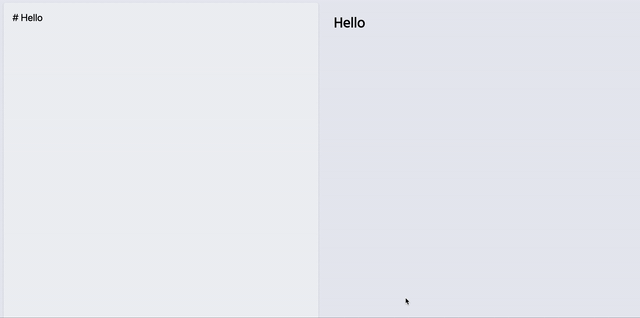

- Creating Markdown Editor in React using React States.
- To run the project:
    - Clone or Download the repo.
    - Go to the folder directory.
    - Run `npm install`
    - Used external [react-markdown](https://github.com/rexxars/react-markdown)
    - Install `npm install --save react-markdown`
    - Run react server `npm start`
